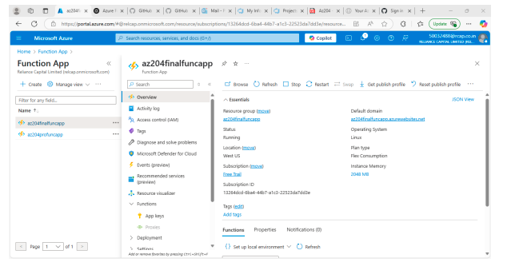
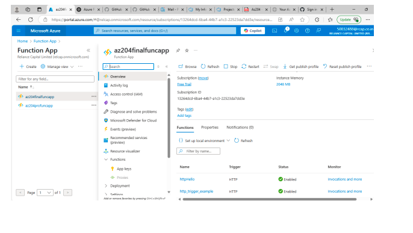
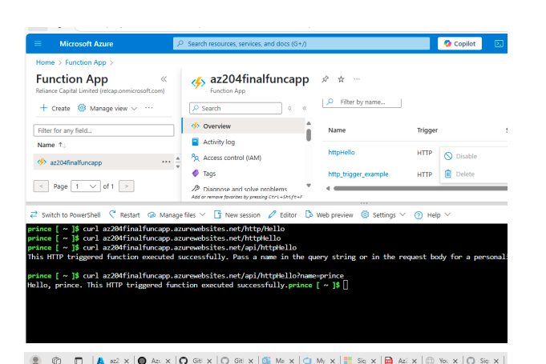

# Azure Cosmos DB with .NET – AZ-204 Project 2

## 🚀 Overview

This project demonstrates how to provision and configure an **Azure Cosmos DB** database using the Azure Portal and interact with it using a **.NET console application**. This serves as a Proof of Concept (PoC) for Skill-Up Online to explore managed database services on Azure.

## 🧰 Tools & Technologies

- Microsoft Azure Portal
- Azure Cosmos DB (SQL API)
- Azure Resource Manager
- .NET Console Application (C#)
- Azure SDK for .NET

## 🔄 Project Tasks

1. Created a new **Resource Group** named `AZ204-Project2-RG` in the **East US** region.
2. Provisioned a **Cosmos DB account** using the **SQL API**.
3. Created a **Cosmos database** and a **collection (container)** in the Cosmos DB account.
4. Changed the **consistency level** to `Eventual`.
5. Built a **.NET console app** to:
   - Connect to Cosmos DB
   - Create a database and container
   - Insert and retrieve documents
6. Tested end-to-end CRUD operations from the .NET app.

📸 Screenshots

Cosmos DB resource overview

Consistency level settings

.NET app console output

✅ Outcome
Successfully provisioned a Cosmos DB instance on Azure.

Connected and operated on it using a .NET app.

Learned to configure consistency levels and collections.

📚 What I Learned
Basics of Cosmos DB (SQL API)

How to use Azure SDK for .NET

Managing consistency and containers in Cosmos DB
